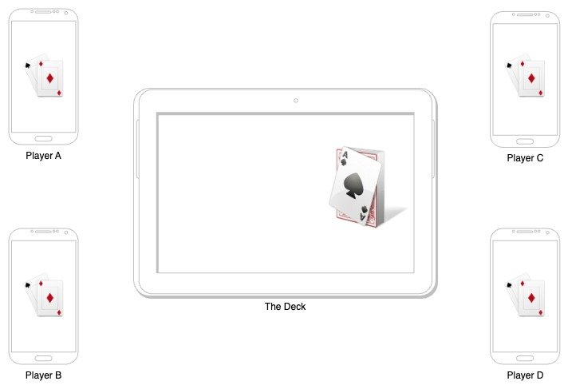

 

    <h1> The Deck</h1>

<b>🕹️ Mobile multiplayer offline card games aggregator 🚀</b>
<b>👨‍💻 Written 💯 in Dart and Flutter 🔨</b>

<i>The inspiration for “The Deck” came from a situation many of us have experienced. Imagine gathering with friends for a game night, only to realize that nobody has the necessary cards. Frustrating, right? This dilemma sparked the idea of leveraging technology to create a solution.</i>

  

The primary goal of “The Deck” is to provide a user-friendly and cooperative digital game environment for playing classic games that were usually played with cards on paper. One of the standout features of “The Deck” is its unique ability to assign one device as the “table” (a.k.a. deck). By placing this device in the middle of the group, all players can witness the real-time state of the cards. This adds a new level of immersion making it a truly captivating experience.

  

## Read more 

* <b> ⚙️ How it works 👀: </b> 
    * [Game Night Just Got a Digital Upgrade: The Deck](https://igorsteblii.com/thedeck/)
    * [Dev.to](https://dev.to/ilbets/game-night-just-got-a-digital-upgrade-the-deck-67p)
    * [Medium](https://medium.com/@igorsteblii/game-night-just-got-a-digital-upgrade-the-deck-unique-cooperative-game-simulator-98e9db13c0f6)
    * PlantUML diagrams here - [/documentation](documentation)

* [getthedeck.com](https://getthedeck.com/)
* [ProductHunt](https://www.producthunt.com/products/the-deck#the-deck)

* 🍎 [AppStore](https://apps.apple.com/us/app/the-deck-play/id6448377728)
* 🤖 [PlayStore](https://play.google.com/store/apps/details?id=com.thedeck.app)
    * [PlayStore Web](https://play.google.com/apps/testing/com.thedeck.app)

## Contribute

Contribution is welcome 🤝

<b>If you contributed and build a new Game, ping me if you wish it to be released on the store markets.</b>
me@getthedeck.com

# Flutter 

## Setup

[Use FVM to manage Flutter SDK version](https://fvm.app/docs/guides/faq/)

 * install `fvm` with `brew`
 * Setup Flutter version from pubspec `fvm use x.y.z`
    *  Read version here: [fvmrc](.fvmrc)
 * run with `fvm flutter run` 

## MR / Pull Request
 
 Naming convention, start commit description with: 

* (FEAT) - feature 
* (FIX) - bug fix
* (CHORE) - refactoring, updating dependencies, etc
* (TEST) - tests

## Release

### Android
* For App Store release ⭐️
    * fvm flutter build appbundle --release 
* Fat APK with all ABI
    * fvm flutter build apk --release 
    * Upload file to Play store
* For split-abi APK testing
    * fvm flutter build apk --release  --split-per-abi

### iOS

* Archive for App store upload ⭐️
    * fvm flutter build ipa --release 
    * open file with Xcode, validate and upload
* IPA file to drag & drop into iphone:
    * fvm flutter build ipa --release  --export-options-plist="/Users/igor.steblii/Projects/foundation_tone/ft_fe/build/ios/archive/Runner.xcarchive/Info.plist"

## Common errors 

 * In case VS code fail with missing Cocoapods 
 * * fvm flutter clean + fvm flutter pub get + Reload VSCode

 * For `normalize': Unicode Normalization not appropriate for ASCII-8BIT (Encoding::CompatibilityError)`
 * Run: `export LC_ALL=en_US.UTF-8`

 * for wrong locale `export LANG="en_US.UTF-8`
 * Run `locale` if there is any `C`, then run `export LC_ALL=en_US.UTF-8`

 * For `flutterfire` script fails with `"unhandle JSON exception"`
 * Download json/plist form Firebase and update in respective folders (https://github.com/invertase/flutterfire_cli/issues/30)
 
 * iOS Device require permission to connect to local network, which cannot be access from code. To emulate access query local IP address
 * Another way is to add permission to `Info.plist` to ask on app start:
 * * <key>NSLocalNetworkUsageDescription</key>
 * * <string>Access to the local network required to create and connect to game rooms</string>

 * For `Error when reading 'lib/objectbox.g.dart': No such file or directory`
 * * Run: `fvm flutter pub run build_runner watch --delete-conflicting-outputs`

# Tools

To generate a new Redux template see [scripts](scripts)

# License 

This project is licensed under the terms of the MIT license.