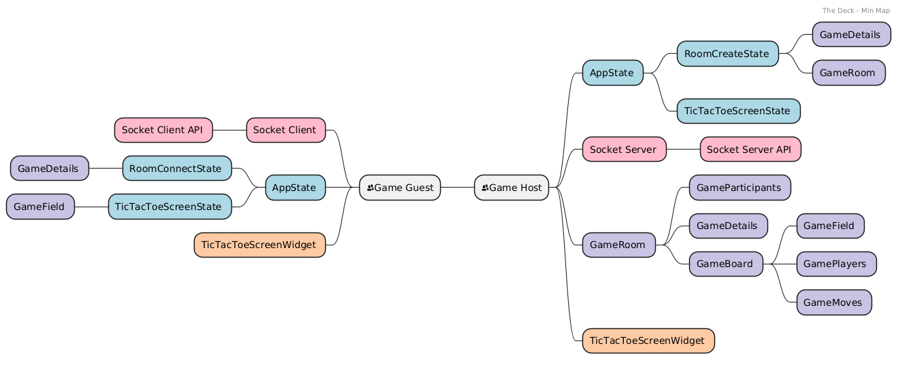
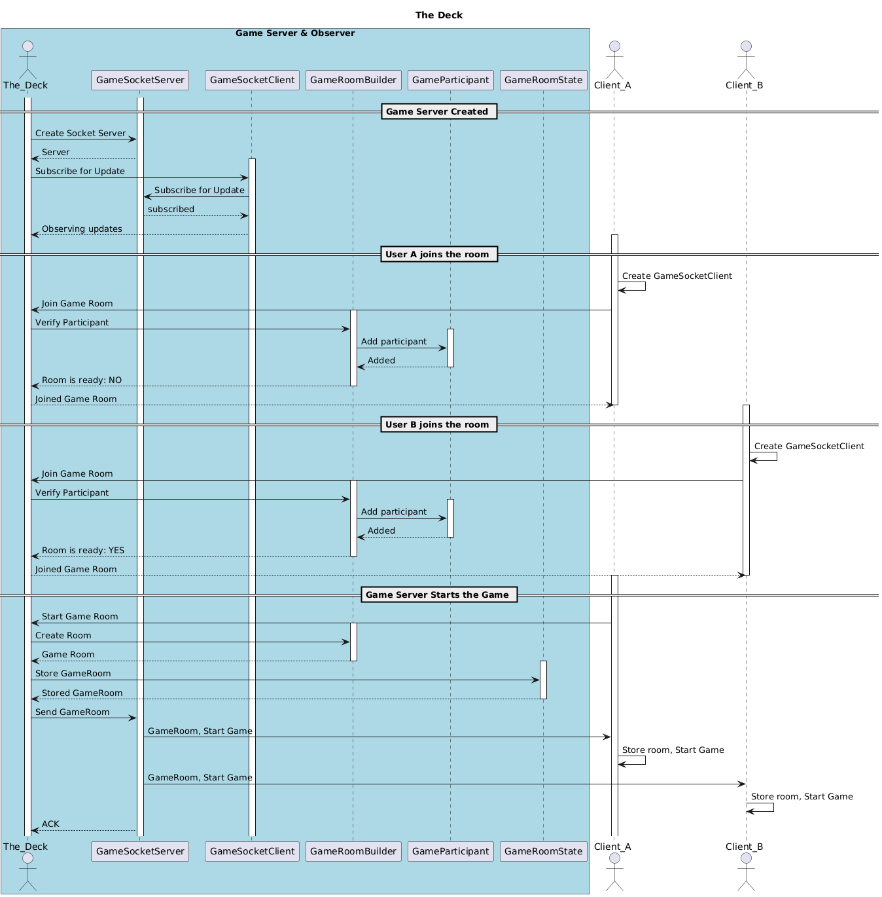
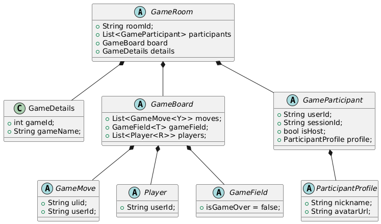
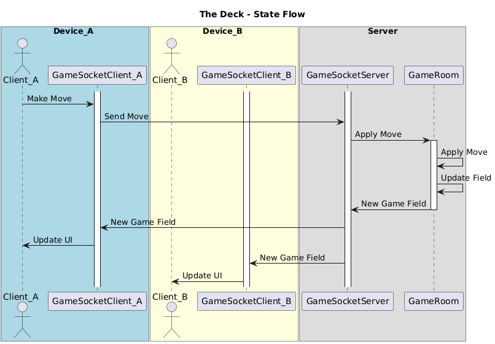
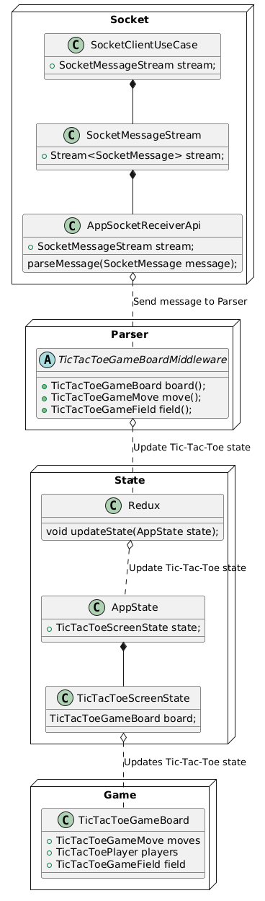

# Documentation 

Plant UML diagrams

## Read more 

* <b> ⚙️ How it works 👀: </b> 
    * [Game Night Just Got a Digital Upgrade: The Deck](https://igorsteblii.com/thedeck/)
    * [Dev.to](https://dev.to/ilbets/game-night-just-got-a-digital-upgrade-the-deck-67p)
    * [Medium](https://medium.com/@igorsteblii/game-night-just-got-a-digital-upgrade-the-deck-unique-cooperative-game-simulator-98e9db13c0f6)

## Preview

<table>
  <tr>
    <td></td>
  </tr>
  <tr>
    <td></td>
  </tr>
  <tr>
    <td></td>
  </tr>
  <tr>
    <td></td>
  </tr>
  <tr>
    <td></td>
  </tr>
</table>

## Install

For Plan URM support, follow the instructions [here](https://plugins.jetbrains.com/plugin/7017-plantuml-integration)

* Install plugin - PlantUML Integration
* Install Graphviz - `brew install graphviz`
* Update link to Graphviz - `brew link --overwrite graphviz` 
* run `which dot` to get the path to the dot executable
* export `GRAPHVIZ_DOT=dot` where dot is the path to the dot executable
* restart IntelliJ
* Open a PlantUML file and click on the settings, select checkbox to use `dot` from `GRAPHVIZ_DOT` path

